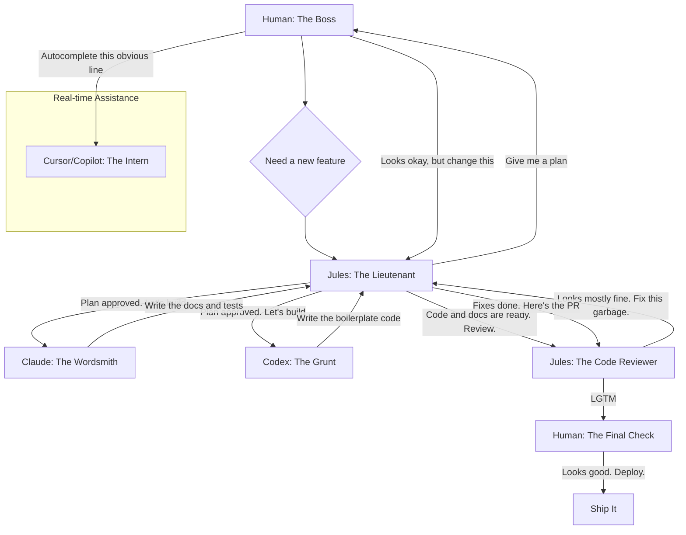

So, you're all excited about AI. "It's going to change everything," you say. "It writes code for me," you cry. Bullshit. Most of you are just poking it with a stick, getting it to write trivial FizzBuzz implementations, and then acting like you've discovered fire. You're not engineering; you're playing with a fancy toy.

Let's get one thing straight: AI is not a replacement for a brain. It's a tool. A powerful one, yes, but a dumb one. It's like a junior programmer with infinite patience and zero understanding. If you want to get real work done, you don't just "use AI." You have to *manage* it.

## Your New, Weird, Asynchronous Dev Team

Stop thinking of it as one monolithic "AI." That's just marketing garbage. In any serious project, you're dealing with a team of specialized agents. You, the human, are the project lead. Your job is to break down the problem and delegate.

Here's a workflow that doesn't suck. It's based on a simple principle: use the right tool for the right job. You wouldn't use a screwdriver to hammer a nail. So why are you asking a language model to do systems architecture?

This is how I see it. You are the boss. The rest are your team.

### The Players

1.  **You (The Human)**: You're the architect. The boss. The one with the actual requirements. Your job is to have the vision, make the hard decisions, and, most importantly, to *review the work*. If you blindly trust what the AI gives you, you deserve the mess you'll get.

2.  **Jules (The Lieutenant / The Planner)**: This is your high-level agent. You don't ask it to write a for-loop. You ask it for a system design. A project skeleton. A plan of attack. It's the one you have a conversation with about the architecture. It breaks down the epic into smaller stories and delegates to the specialists. It also does the initial code review, catching the obvious stuff before it wastes your time.

3.  **Claude (The Wordsmith)**: This one is good with language. So use it for that. Give it a chunk of code and tell it to write the documentation. Or have it generate unit tests based on a function's signature and a brief description. It's for well-defined, text-heavy tasks.

4.  **Codex (The Grunt)**: This is your workhorse for pure code generation. You give it a very specific task: "Write a Python function that takes a user ID and fetches their profile from the database, returning a `User` object. Here's the schema." It's not for creative work. It's for turning a clear spec into boilerplate code. Fast.

5.  **Cursor/Copilot (The Intern at Your Elbow)**: This is just your autocomplete on steroids. It's running alongside you, suggesting the next line of code. It's great for reducing typing and handling the trivial, predictable stuff. It's not for designing a system. It's for finishing your thought.

## Stop Babysitting, Start Managing

See the pattern? You're not writing every line of code. You're also not sitting back and waiting for the magic to happen. You're acting as a manager.

-   **Delegation**: You break the work down and give it to the right agent.
-   **Specification**: You provide clear, unambiguous instructions. Garbage in, garbage out. If your spec is lazy, the result will be trash.
-   **Review**: You are the ultimate gatekeeper. You review the pull requests. You run the code. You are responsible for the quality.

Thinking you can just prompt your way to a finished, complex application is a fantasy. It's not going to happen. The real productivity gain comes from leveraging these tools to automate the tedious parts of development, freeing you up to focus on the hard parts: architecture, logic, and making sure the damn thing actually works.

So stop whining that the AI "isn't good enough." It's a tool. Learn to use it properly. Manage your team. Now get back to work.