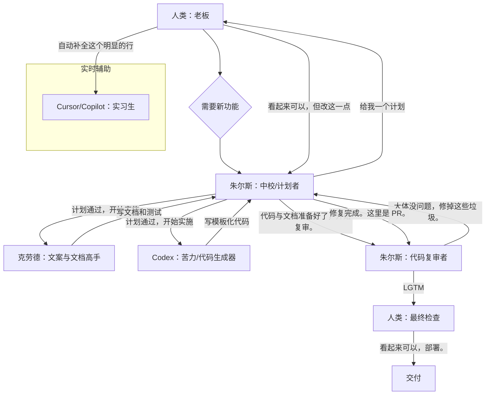
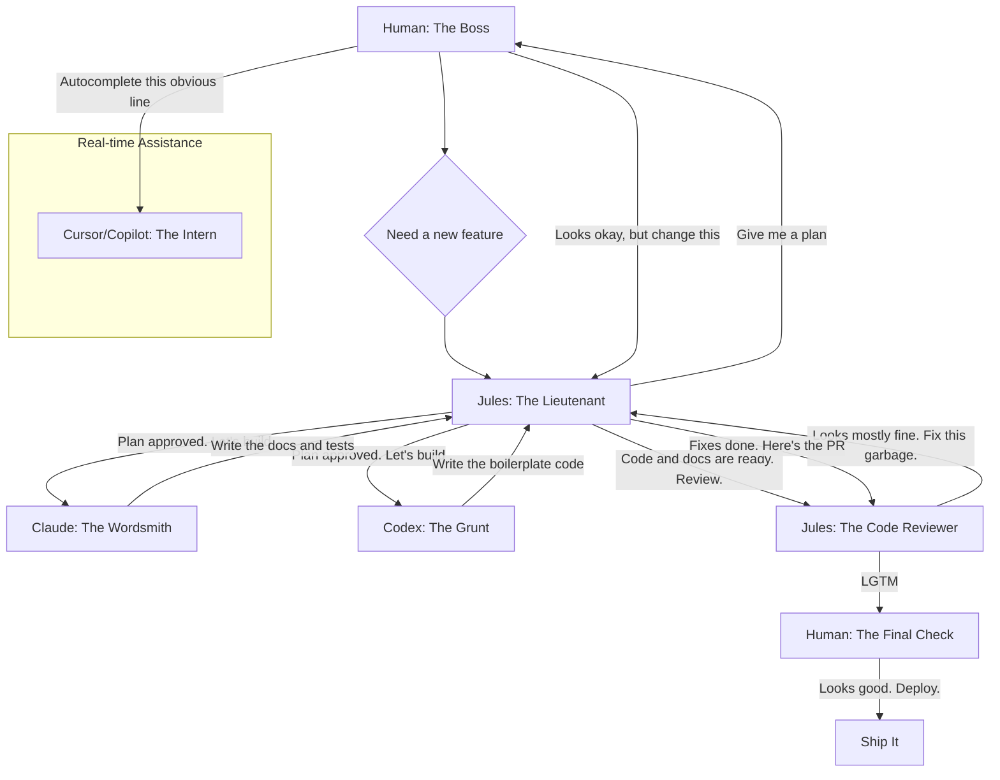

````mdx
---
title: '别再抱怨，管好你的 AI：实用工作流'
date: '2024-07-26'
tags: ['ai', 'workflow', 'development', 'rant']
summary: "很多人把 AI 当成魔法来谈论。它不是魔法，而是工具；而大多数人像拿着一把笨重的锤子在用它。下面是一个务实的指南，教你如何像管理一群非常快、非常字面、没有常识的初级开发者那样管理 AI 代理。"
authors: ['default']
---
好吧，你们都对 AI 激动不已。“它会改变一切，”你们说。“它可以为我写代码，”你们喊道。别扯淡。大多数人只是在戳它，让它写些鸡毛蒜皮的 FizzBuzz，然后以为自己发现了火。你们不是工程师，在玩一个华而不实的玩具。

先说清楚一件事：AI 不能替代人的思考。它是一个工具。一个强大的工具，没错，但也是个愚笨的工具。它更像是一个有无限耐心但毫无理解力的初级程序员。要想做成真正的工作，你不能仅仅“使用 AI”。你必须去*管理*它。

## 你那支奇怪的异步开发团队

别再把它当成一个整体的“AI”。那不过是营销话术。在任何认真的项目里，你面对的是一群分工明确的代理。你——人类——是项目负责人。你的工作是拆解问题并分配任务。

这是一个不会让人抓狂的工作流，基于一个简单原则：每项工作用最合适的工具。你不会用螺丝刀去敲钉子，为什么要让一个语言模型去做系统架构？

我是这么看的：你是老板，其他的都是你的团队。



### 成员说明

1.  **你（人类）**：架构师，老板，也是提出真实需求的人。你的工作是提供愿景、做出困难决定，并且最重要的是——*审查工作*。如果你盲信 AI 的输出，那结果的烂摊子就是活该。

2.  **朱尔斯（中校 / 计划者）**：这是你的高阶代理。你不会让它写一个 for 循环，你让它给出系统设计、项目骨架和实施计划。它负责把史诗级任务拆成较小的 story，并分派给专职代理。它也会做初步代码审查，抓住明显的低级错误，避免浪费你的时间。

3.  **克劳德（文案与文档高手）**：擅长处理语言相关的任务。用它来写文档、生成基于函数签名的单元测试描述，或把代码块转换成可读的说明。它适合定义明确、以文本为主的工作。

4.  **Codex（苦力 / 代码生成器）**：写模板化代码的主力。给它非常明确的任务："写一个 Python 函数，接收用户 ID，从数据库取回资料并返回一个 User 对象，这里是表结构。" 它不是用来做创造性工作的，而是把明确的规范快速转换为样板代码。

5.  **Cursor/Copilot（在你旁边的实习生）**：就是增强版的自动补全。它陪你写代码，建议下一行内容。它能减少输入量、处理可预测的琐碎工作，但不负责系统设计——它用来帮你完成思路。

## 别再当保姆，开始做管理者

看到规律了吗？你不是在写每一行代码，也不能坐等奇迹发生。你是在扮演管理者。

-  **委派**：把工作拆解并交给合适的代理。
-  **规范**：给出清晰、无歧义的指令。垃圾输入产生垃圾输出。如果你的规格含糊，结果只会很糟。
-  **审查**：你是最终的把关人。你审查 PR、运行代码，对质量负责。

别指望通过不断提示就能拿到一个复杂应用的成品——那是幻想。真正的生产力提升来自于把枯燥重复的部分自动化，从而让你把精力放在困难的事情上：架构、业务逻辑，以及确保东西真的能跑起来。

所以别再抱怨 AI "不够好"。它只是个工具。学会正确使用它，管理好你的团队。现在回去干活吧。
````
---
title: 'Stop Whining and Manage Your AIs: A Real Workflow'
date: '2024-07-26'
tags: ['ai', 'workflow', 'development', 'rant']
summary: "People keep talking about AI like it's magic. It's not. It's a tool, and most of you are using it like a clumsy hammer. Here's a no-nonsense guide to using AI agents like you'd manage a team of junior developers who are very fast, very literal, and have no common sense."
authors: ['default']
---

So, you're all excited about AI. "It's going to change everything," you say. "It writes code for me," you cry. Bullshit. Most of you are just poking it with a stick, getting it to write trivial FizzBuzz implementations, and then acting like you've discovered fire. You're not engineering; you're playing with a fancy toy.

Let's get one thing straight: AI is not a replacement for a brain. It's a tool. A powerful one, yes, but a dumb one. It's like a junior programmer with infinite patience and zero understanding. If you want to get real work done, you don't just "use AI." You have to *manage* it.

## Your New, Weird, Asynchronous Dev Team

Stop thinking of it as one monolithic "AI." That's just marketing garbage. In any serious project, you're dealing with a team of specialized agents. You, the human, are the project lead. Your job is to break down the problem and delegate.

Here's a workflow that doesn't suck. It's based on a simple principle: use the right tool for the right job. You wouldn't use a screwdriver to hammer a nail. So why are you asking a language model to do systems architecture?

This is how I see it. You are the boss. The rest are your team.



### The Players

1.  **You (The Human)**: You're the architect. The boss. The one with the actual requirements. Your job is to have the vision, make the hard decisions, and, most importantly, to *review the work*. If you blindly trust what the AI gives you, you deserve the mess you'll get.

2.  **Jules (The Lieutenant / The Planner)**: This is your high-level agent. You don't ask it to write a for-loop. You ask it for a system design. A project skeleton. A plan of attack. It's the one you have a conversation with about the architecture. It breaks down the epic into smaller stories and delegates to the specialists. It also does the initial code review, catching the obvious stuff before it wastes your time.

3.  **Claude (The Wordsmith)**: This one is good with language. So use it for that. Give it a chunk of code and tell it to write the documentation. Or have it generate unit tests based on a function's signature and a brief description. It's for well-defined, text-heavy tasks.

4.  **Codex (The Grunt)**: This is your workhorse for pure code generation. You give it a very specific task: "Write a Python function that takes a user ID and fetches their profile from the database, returning a `User` object. Here's the schema." It's not for creative work. It's for turning a clear spec into boilerplate code. Fast.

5.  **Cursor/Copilot (The Intern at Your Elbow)**: This is just your autocomplete on steroids. It's running alongside you, suggesting the next line of code. It's great for reducing typing and handling the trivial, predictable stuff. It's not for designing a system. It's for finishing your thought.

## Stop Babysitting, Start Managing

See the pattern? You're not writing every line of code. You're also not sitting back and waiting for the magic to happen. You're acting as a manager.

-   **Delegation**: You break the work down and give it to the right agent.
-   **Specification**: You provide clear, unambiguous instructions. Garbage in, garbage out. If your spec is lazy, the result will be trash.
-   **Review**: You are the ultimate gatekeeper. You review the pull requests. You run the code. You are responsible for the quality.

Thinking you can just prompt your way to a finished, complex application is a fantasy. It's not going to happen. The real productivity gain comes from leveraging these tools to automate the tedious parts of development, freeing you up to focus on the hard parts: architecture, logic, and making sure the damn thing actually works.

So stop whining that the AI "isn't good enough." It's a tool. Learn to use it properly. Manage your team. Now get back to work.